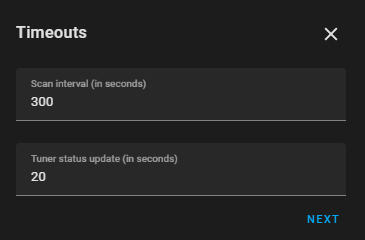
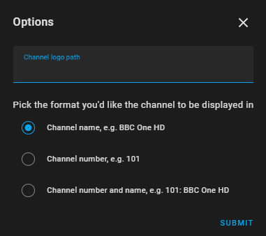

# HDHomeRun

Home Assistant integration for the Silicondust HDHomeRun network tuners.

## Description

This integration can be used to get basic information on each HDHomeRun 
device in the network.

### Entities Provided
Where applicable the sub-items in the list detail the additional attributes 
available.

#### Binary Sensors

- Update available - denotes whether there is a firmware update available 
  for the device

#### Sensors

- Channel Count - the number of channels currently tuned on the device
- Version - the current firmware version of the device
- Tuner Count - the number of tuners the device has
- Newest Version - the latest version of firmware available for the device
- Tuner X - where X is the tuner number (states can be: `Idle`, `In use`, 
  `Scanning` or the channel being watched, using the specified format)
  - virtual channel number, virtual channel name, frequency, signal strength,
    signal quality, symbol quality, network rate and target IP 

## Setup

### `Add Integration` button

If adding the integration by clicking the `Add Integration` button the 
following information will be requested. 


- `Friendly name`: (optional) The name you'd like the device to appear as. 
  If left blank one will be generated for you. 
- `Host`: (required) The IP of HDHomeRun on the network.

On successful set up the following screen will be seen detailing the device.


### Discovery

The integration can also detect the HDHomeRun devices on the network. When 
found they will look like this on your devices screen.


Clicking `CONFIGURE` will prompt for the following information.


On successful set up the following screen will be seen detailing the device.


The name used is derived from the device details. If this isn't friendly 
enough then you change the name here.

## Configurable Options

It is possible to configure the following options for the integration.

### Timeouts



- `Scan Interval`: the frequency of updates for the sensors, default `300s`
- `Tuner status update`: the frequency of updates for tuners, default `10s`

### Options



From here you can select which format should be used for the sensor. The 
default is `Channel name`.

*This setting is only effective when a tuner is actively tuned to a channel.*

## Troubleshooting

### Debug Logging

Debug logging can be enabled in Home Assistant using the `logger` 
integration see [here](https://www.home-assistant.io/integrations/logger/).

```yaml
logger:
  default: warning
  logs:
    custom_components.hdhomerun: debug
```

### Diagnostics Integration

Starting with Home Assistant 2022.2 a new diagnostics integration can be 
used to provide troubleshooting for integrations.

The highlighted area in the image below shows where the link for downloading 
diagnostics can be found.


Example output can be found [here](examples/diagnostics_output.json)
